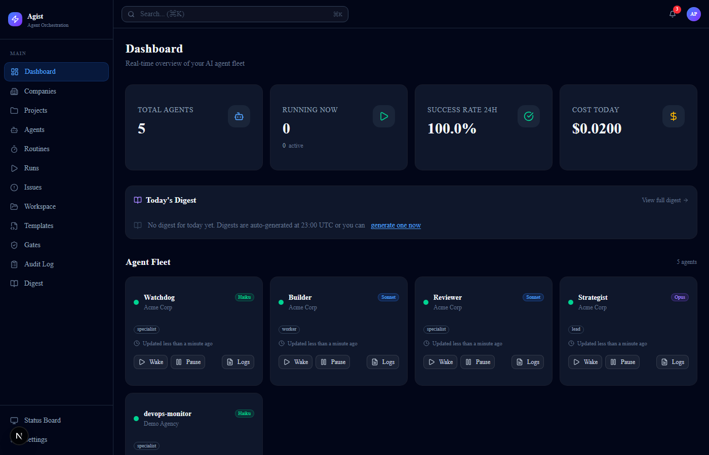
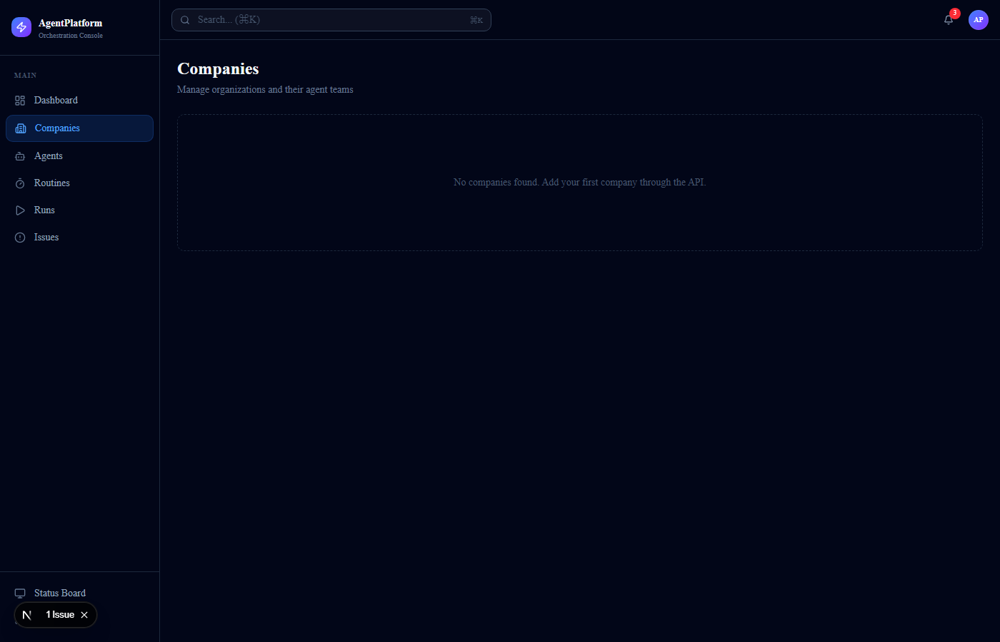
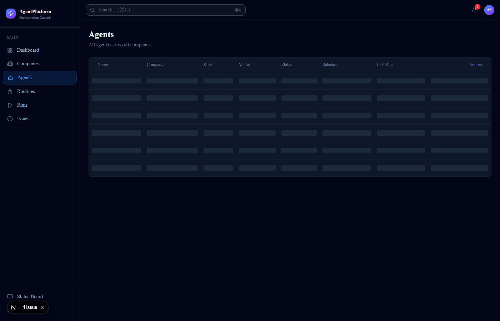

<p align="center">
  
</p>

<h1 align="center">Agist</h1>

<p align="center">
  <strong>Open-source AI agent orchestration platform</strong><br/>
  Manage your AI agent teams from a single dashboard.
</p>

<p align="center">
  <a href="#quickstart">Quickstart</a> &bull;
  <a href="#features">Features</a> &bull;
  <a href="#screenshots">Screenshots</a> &bull;
  <a href="#architecture">Architecture</a> &bull;
  <a href="#contributing">Contributing</a>
</p>

<p align="center">
  
  
  
  
</p>

---

## What is Agist?

Agist is a lightweight, self-hosted control plane for AI coding agents. If you're running multiple Claude Code, Codex, or other AI agents and losing track of who's doing what — Agist gives you a dashboard.

```
You define goals → Agist schedules agents → Agents do the work → You review from the dashboard
```

**30-second setup. No PostgreSQL. No Docker. Just `npx`.**

### Agist vs Others

| | Agist | Paperclip | CrewAI | Claude Squad |
|---|---|---|---|---|
| Setup time | 30 seconds | 20+ minutes | 10+ minutes | 5 minutes |
| Database | SQLite (zero config) | PostgreSQL required | Python deps | None (no persistence) |
| Dashboard | Web + Mobile PWA | Web only | SaaS only | Terminal TUI |
| Real-time | WebSocket + SSE | Polling | SaaS | Terminal |
| Self-hosted | Yes | Yes (complex) | Partial | Yes |
| Multi-company | Yes | Yes | No | No |
| Cost tracking | Built-in with charts | Text budgets | SaaS | None |
| Price | Free & open source | Free | $99+/mo | Free |

---

## Quickstart

### Option 1: npx (fastest)

```bash
npx agist setup   # interactive wizard — sets ports, API keys, data dir
npx agist start   # starts backend + frontend
```

Open **http://localhost:3004** — that's it.

### Option 2: Git clone

```bash
git clone https://github.com/tahakotil/agist.git
cd agist
pnpm install
pnpm seed    # load demo data (optional)
pnpm dev     # opens dashboard at localhost:3004
```

> **Requirements:** Node.js 20+, pnpm 9+

### Option 3: Docker

```bash
# Clone and start with Docker Compose (includes automatic HTTPS via Caddy)
git clone https://github.com/tahakotil/agist.git
cd agist
docker compose up -d
```

Access at **http://localhost** (Caddy handles routing and HTTPS automatically).

For a custom domain with automatic TLS:
```bash
DOMAIN=agents.yourdomain.com docker compose up -d
```

---

## CLI Reference

The `agist` CLI manages your local installation:

```bash
npx agist setup    # interactive setup wizard
npx agist start    # start backend + frontend
npx agist status   # show server health, agent fleet, KPIs
npx agist logs <agentId>   # stream live logs for an agent
npx agist logs "*"          # stream all agent logs
```

---

## API Authentication

By default auth is disabled for local development. To enable:

```bash
# Set in environment or .env
AGIST_AUTH_DISABLED=false
```

All API requests must then include the `X-Api-Key` header:

```bash
curl http://localhost:4400/api/agents \
  -H "X-Api-Key: agist_<your-key>"
```

The API key is generated during `npx agist setup` and stored in `~/.agist/config.json`. The dashboard reads it automatically from `localStorage`.

---

## Configuration

All configuration via environment variables (see `.env.example` for full list):

| Variable | Default | Description |
|----------|---------|-------------|
| `PORT` | `4400` | Backend API port |
| `NODE_ENV` | `development` | Environment |
| `AGIST_AUTH_DISABLED` | `true` | Disable API key auth (dev only) |
| `CORS_ORIGINS` | `http://localhost:3004` | Allowed CORS origins |
| `LOG_LEVEL` | `info` | Logging level (debug/info/warn/error) |
| `ANTHROPIC_API_KEY` | — | Anthropic API key for Claude |
| `RUN_TTL_DAYS` | `30` | Auto-delete runs older than N days |

---

## Screenshots

<p align="center">
  
  <br/><sub>Dashboard — Real-time overview with stat cards, cost chart, and agent fleet</sub>
</p>

<p align="center">
  
  <br/><sub>Companies — Multi-company management with agent counts and budgets</sub>
</p>

<p align="center">
  
  <br/><sub>Agents — Model routing (Haiku/Sonnet/Opus), status, and schedule overview</sub>
</p>

---

## Features

### Agent Management
- Create agents with name, role, model, capabilities
- Model routing: Haiku (cheap), Sonnet (balanced), Opus (deep reasoning)
- Agent hierarchy with `reportsTo` relationships
- Per-agent budget caps with cost tracking

### Scheduled Heartbeats
- Cron-based scheduling (every 30min to weekly)
- Automatic Claude CLI spawning with `--model` flag
- Run history with exit codes, token usage, cost
- Collision-safe offsets between agent schedules

### Live Dashboard
- Real-time agent status via WebSocket
- Terminal-style log viewer with color coding
- Org chart visualization (React Flow)
- Cost tracking charts (Tremor)
- Full-screen status board for wall monitors (`/status`)
- `Cmd+K` command palette

### Multi-Company
- Run multiple companies from one instance
- Complete data isolation per company
- Cross-company projects for coordination

### Developer Experience
- SQLite — no database server, no Docker, no setup
- Zero native dependencies (sql.js = WebAssembly)
- Hot reload in development (tsx watch + Turbopack)
- Dark mode default

---

## Architecture

```
┌─────────────────────────────────────────────────┐
│                   Frontend                       │
│           Next.js 16 + shadcn/ui                │
│          http://localhost:3004                    │
│                                                  │
│  Dashboard  Agents  Runs  Issues  Status Board  │
└──────────────────────┬──────────────────────────┘
                       │ fetch + WebSocket
┌──────────────────────┴──────────────────────────┐
│                    Backend                       │
│              Hono + TypeScript                   │
│          http://localhost:4400                    │
│                                                  │
│  REST API  │  WebSocket  │  SSE  │  Scheduler   │
│            │  (live logs) │       │  (cron)      │
└──────────────────────┬──────────────────────────┘
                       │
┌──────────────────────┴──────────────────────────┐
│                   Database                       │
│           SQLite (sql.js, WAL mode)             │
│          ~/.agent-platform/data.db               │
│                                                  │
│  companies │ agents │ routines │ runs │ issues  │
└─────────────────────────────────────────────────┘
                       │
┌──────────────────────┴──────────────────────────┐
│              Agent Adapter Layer                  │
│                                                  │
│  claude --model <model> --print -p "<task>"      │
│  Streams output → WebSocket → Dashboard          │
└─────────────────────────────────────────────────┘
```

## Tech Stack

| Layer | Technology | Why |
|-------|-----------|-----|
| Frontend | Next.js 16, shadcn/ui, Tremor, React Flow | Modern, fast, beautiful |
| Backend | Hono | 14KB, fastest Node.js framework |
| Database | SQLite (sql.js) | Zero config, zero native deps |
| Real-time | WebSocket + SSE | Bidirectional logs + unidirectional status |
| Scheduler | cron-parser + setInterval | Simple, reliable, no external deps |
| IDs | nanoid | URL-safe, 21 chars, collision-resistant |

## Project Structure

```
agist/
├── packages/
│   ├── cli/             # npx agist CLI
│   │   └── src/
│   │       ├── index.ts
│   │       └── commands/
│   │           ├── setup.ts    # Interactive setup wizard
│   │           ├── start.ts    # Start backend + frontend
│   │           ├── status.ts   # Health + agent fleet status
│   │           └── logs.ts     # Live log streaming (WebSocket)
│   ├── shared/          # Types, validators, constants
│   │   └── src/
│   │       ├── types.ts
│   │       └── validators.ts
│   ├── db/              # SQLite schema, queries, seed
│   │   └── src/
│   │       ├── schema.sql
│   │       ├── db.ts
│   │       ├── queries.ts
│   │       └── seed.ts
│   ├── server/          # Hono API server
│   │   └── src/
│   │       ├── index.ts        # Entry point (port 4400)
│   │       ├── db.ts           # SQLite init (sql.js)
│   │       ├── schema.sql      # Table definitions
│   │       ├── scheduler.ts    # Cron heartbeat scheduler
│   │       ├── adapter.ts      # Claude CLI adapter
│   │       ├── ws.ts           # WebSocket server
│   │       ├── sse.ts          # SSE event stream
│   │       └── routes/
│   │           ├── companies.ts
│   │           ├── agents.ts
│   │           ├── projects.ts
│   │           ├── routines.ts
│   │           ├── runs.ts
│   │           ├── issues.ts
│   │           └── health.ts
│   └── web/             # Next.js dashboard
│       └── src/
│           ├── app/
│           │   ├── (dashboard)/     # Main layout with sidebar
│           │   │   ├── page.tsx     # Status dashboard
│           │   │   ├── agents/
│           │   │   ├── companies/
│           │   │   ├── projects/    # Project management
│           │   │   ├── routines/
│           │   │   ├── runs/
│           │   │   ├── issues/
│           │   │   └── settings/
│           │   └── status/          # Full-screen monitor board
│           ├── components/
│           │   ├── agent-card.tsx
│           │   ├── log-viewer.tsx
│           │   ├── org-chart.tsx
│           │   ├── cost-chart.tsx
│           │   ├── command-palette.tsx
│           │   └── stat-card.tsx
│           └── lib/
│               └── api.ts           # API client
├── Dockerfile           # Multi-stage production build
├── docker-compose.yml   # Agist + Caddy reverse proxy
├── Caddyfile            # Caddy routing config
├── .env.example         # Environment variable reference
├── CLAUDE.md
├── package.json
├── pnpm-workspace.yaml
└── tsconfig.base.json
```

---

## API Reference

### Health
```
GET /api/health → { status: "ok", version: "0.1.0", db: "ok" }
```

### Companies
```
GET    /api/companies
POST   /api/companies              { name, description?, budgetMonthlyCents? }
GET    /api/companies/:id
PATCH  /api/companies/:id
DELETE /api/companies/:id
```

### Agents
```
GET    /api/companies/:cid/agents
POST   /api/companies/:cid/agents  { name, role, model?, title?, capabilities? }
GET    /api/agents/:id
PATCH  /api/agents/:id             { model?, status?, adapterConfig? }
DELETE /api/agents/:id
POST   /api/agents/:id/wake        → Spawns Claude CLI, creates run
```

### Projects
```
GET    /api/companies/:cid/projects
POST   /api/companies/:cid/projects { name, description?, workingDirectory? }
GET    /api/projects/:id
PATCH  /api/projects/:id
DELETE /api/projects/:id
```

### Routines
```
GET    /api/companies/:cid/routines
POST   /api/companies/:cid/routines { agentId, title, cronExpression, timezone? }
PATCH  /api/routines/:id
DELETE /api/routines/:id
```

### Runs
```
GET    /api/runs/recent
GET    /api/agents/:aid/runs
GET    /api/runs/:id
```

### Real-time
```
WS  ws://localhost:4400/ws     → Subscribe: { type: "subscribe", agentId: "..." }
SSE /api/events                → Agent status changes, run completions
```

---

## Model Routing

Assign each agent the right model for the job:

| Model | ID | Best For | Cost |
|-------|-----|---------|------|
| Haiku 4.5 | `claude-haiku-4-5-20251001` | Health checks, monitoring, simple tasks | Lowest |
| Sonnet 4.6 | `claude-sonnet-4-6` | Core development, content, analysis | Balanced |
| Opus 4.6 | `claude-opus-4-6` | Strategic decisions, deep reasoning | Highest |

```bash
# Update agent model via API
curl -X PATCH http://localhost:4400/api/agents/<id> \
  -H "Content-Type: application/json" \
  -d '{"model": "claude-haiku-4-5-20251001"}'
```

---

## Contributing

Contributions welcome. See [CONTRIBUTING.md](CONTRIBUTING.md) for guidelines.

```bash
# Development setup
git clone https://github.com/tahakotil/agist.git
cd agist
pnpm install
pnpm dev   # starts both backend and frontend
```

---

## License

MIT - see [LICENSE](LICENSE).

---

<p align="center">
  Built by <a href="https://github.com/tahakotil">Taha Kotil</a><br/>
  <sub>AI agent orchestration for everyone.</sub>
</p>
